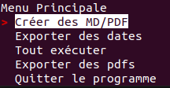
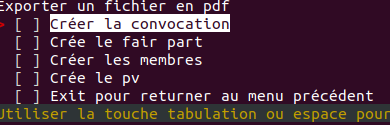
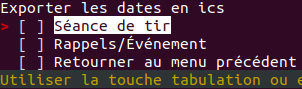
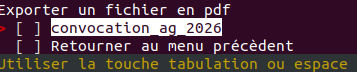
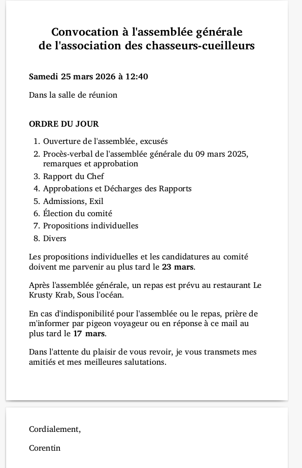

# secretary_task_manager

Outil d'automatisation documentaire développé pour le secrétariat de la
Société de tir de Laconnex. Il génère les documents administratifs récurrents
de l'association à partir de modèles Markdown, via un menu en ligne de commande.

Chaque document est produit **en Markdown et en PDF**. Le Markdown reste
éditable : si une erreur apparaît sur le PDF, le secrétaire corrige le fichier
source et régénère le document, sans repasser par un logiciel de mise en page.

## Documents pris en charge

| Document | Modèle (`template/`) | Autres entrées (`data/`) |
|---|---|---|
| Convocation | `convocation_ag.md` | variables |
| PV d'assemblée générale | `pv_ag.md` | variables |
| Faire-part | `faire_part.md` | `Annonce_des_jours_de_tirs_<ANNÉE>.pdf` & variable |
| Liste des membres | modèle Markdown | `membres.csv` & variable |

## Fonctionnement

### Variables

Dans les modèles, le secrétaire peut placer des variables dans le markdown selon la syntaxe suivant

- `{{NOMVARIABLE}}` — valeur récurrente définie dans `data/valConst.csv`

Format de `valConst.csv` (une variable par ligne) :

```
NomVariable;Valeur;Commentaire (facultatif)
```

### Convocation, PV_AG, Faire-part et Membres

Le secrétaire rédige le texte et le style (CSS) dans le modèle Markdown
correspondant, en y insérant les marqueurs. Le faire-part lit en plus un PDF
`data/Annonce_des_jours_de_tirs_<ANNÉE>.pdf` contenant les dates des séances de tir.
La liste de membres lit aussi un csv `data/event.csv` 

### Liste des membres

Génère un tableau des membres et de leurs rôles (Markdown + PDF) à partir de
`data/membres.csv`, au format :

```
Role;Nom;Prenom;Adresse;Lieu;Date de Naissance;Entree;Tel.;Tel.prive;Mail
```

Seuls `Role`, `Nom` et `Prenom` sont utilisés par le programme ; les autres
champs sont conservés pour les besoins administratifs du secrétariat.

### Event

Le secrétaire peut insèrer des date à partir de `data/event.csv`, au format :

```
DateDébut(YYYY-MM-DD);DateFin(YYYY-MM-DD);Description;HeureStart;HeureFin
```

Ces dates peuvent ensuite être exportées avec le programme


## Structure du projet

```
main.py               point d'entrée (menu terminal)
requirements.txt
script/
    user_interface.py menu et interactions utilisateur
    md_generator.py   génération Markdown puis conversion PDF
    calendar_event.py lecture des dates et export .ics
template/             modèles Markdown des documents
data/                 données sources 
    membres.csv       contient les informations des membres 
    valConst.csv      contient les variables utilisées pour remplir les markdown
    event.csv         contient les dates à export en .ics
AnnéeActuel/          crée automatiquement au lancement. stock les markdowns et pdf génèrés
```

## Stack

- **Python**
- [simple-term-menu](https://pypi.org/project/simple-term-menu/) — menu interactif au terminal
- **pandas** — manipulation des données membres et lectures des variables
- **pypdf** — lecture du PDF des dates de tir
- **ics** — export des dates au format calendrier (`.ics`)
- **markdown-pdf** — conversion Markdown → PDF
- **re** — analyse des marqueurs par expressions régulières

## Menu


Tout les sous menus permettent à l'utilisateur de sélectionner un ou plusieurs options à l'aide de la tabulations. Il est d'ailleurs possibles
par exemple de générer la convocation et de quitter le menu actuel pour revenir au menu principale







Ce menu est dynamique, il n'affiche que les markdowns ayant déjà été générer par le programme

## Installation

```bash
git clone https://github.com/Ivanneuf/secretary_task_manager.git
cd secretary_task_manager
pip install -r requirements.txt
python main.py
```

## Portée

Outil développé sur mesure pour les documents de la Société de tir de Laconnex :
les modèles et les règles de génération sont spécifiques à cette association. Bien qe la fonction de 
remplissage de md avec variable pourrait être adapté pour n'importe quel documents.

## Contexte

Mandat réalisé en février–mars 2025. Logiciel utilisé en production par le
secrétariat de l'association.


